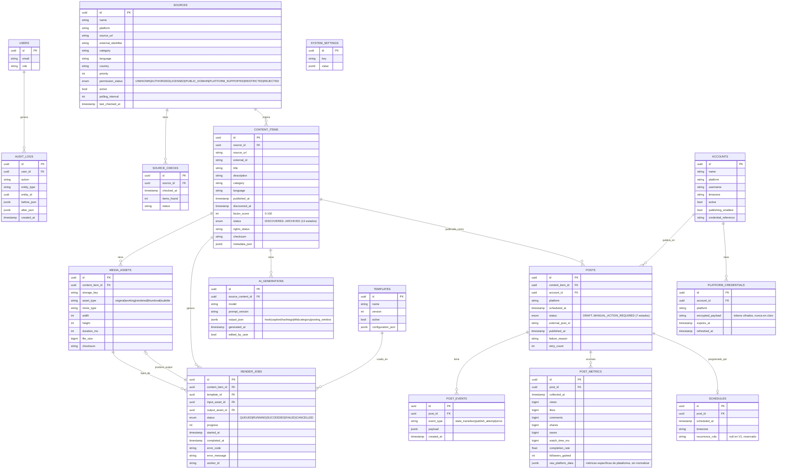

# Factor Content — ERD inicial (V1)

Todas las tablas usan UUID como PK, y todas tienen `created_at`/`updated_at`
(omitidos abajo por brevedad salvo donde son el foco).



## Notas de diseño
- `POST_METRICS.raw_platform_data` (JSONB) guarda la respuesta cruda de cada
  plataforma; las columnas normalizadas (`views`, `likes`, etc.) son la
  capa común para el dashboard. Esto cumple el punto 16 del spec: "keep raw
  platform data and normalized metrics separate".
- `PLATFORM_CREDENTIALS.encrypted_payload` nunca se expone vía API; se
  descifra solo en memoria dentro de `publishers/<adapter>.py`.
- Los estados de `CONTENT_ITEMS.status` (13) y `POSTS.status` (7) se listan
  completos en el spec original (secciones 5.2 y 15); aquí se referencian
  por brevedad — deben implementarse como `Enum` de Python + `CHECK
  constraint` en la migración, no como string libre.

## Índices críticos (a crear en la primera migración)
```sql
CREATE INDEX ix_content_items_status ON content_items(status);
CREATE INDEX ix_content_items_source_published ON content_items(source_id, published_at);
CREATE INDEX ix_posts_status_scheduled ON posts(status, scheduled_at);
CREATE INDEX ix_posts_account_scheduled ON posts(account_id, scheduled_at);
CREATE INDEX ix_post_metrics_post_collected ON post_metrics(post_id, collected_at);
CREATE INDEX ix_render_jobs_status ON render_jobs(status);
CREATE INDEX ix_source_checks_source_checked ON source_checks(source_id, checked_at);
```
